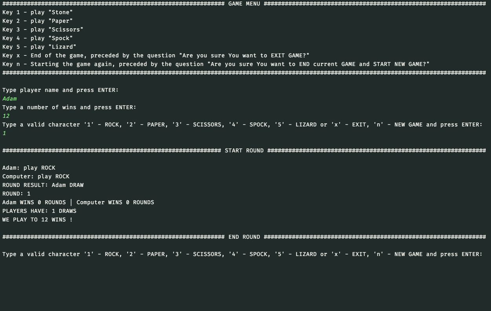

# Paper-Scissors-Rock-Lizard-Spock Console Game

## Table of contents

* [Introduction](##Introduction)
* [Gameplay](##Gameplay)
* [Technology](##Technology)

## Introduction

Play a game called Paper Scissors Rock Lizard Spock game against the computer.

This project was generated with java jdk-11.0.7 LTS version with Gradle

To run application just make few steps:

1. Clone repository to some directory on your computer.
2. First option - Run executable RpsApplication class from your IDE like Eclipse or InteliJ IDEA.
3. Second option - for Windows system open run.bat file using windows command line.
4. Second option - for UNIX system open run.sh file using terminal (grant proper privileges if needed).

## Gameplay

* Game will gave you hints in every step of game so you should easy find yourself during play.
* Firstly type player name and press Enter.
* Secondly type to which amount of wins you want to play.
* Thirdly start to play by passing proper number representing ROCK, PAPER, SCISSORS, SPOCK or LIZARD.
* In every moment of game you can start new game or exit if you want. Below you will find screenshot from game enjoy
  it :)

## Technology

- Java 11
- Gradle
